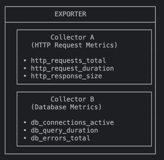
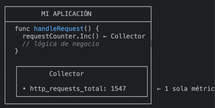
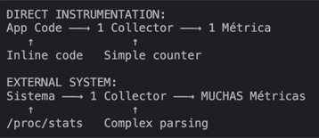

### Alert

* alert
  * == (Prometheus alerting rule / firing)'s outcome 
  * FROM Prometheus,
    * are sent -- to the -- Alertmanager

### Alertmanager

* [Alertmanager's workflow](/docs/alerting/latest/overview/)
  * takes alerts,
  * aggregates them | groups,
  * de-duplicates,
  * applies silences,
  * throttles,
  * sends out notifications -- to -- email, Pagerduty, Slack etc

### Bridge

* bridge
  * == component /
    * client library's samples are exposed -- to a -- NON-Prometheus monitoring system
  * _Example:_ Python, Go, and Java clients can export metrics -- to -- Graphite

### Client library

A client library is a library in some language (e.g. Go, Java, Python, Ruby)
that makes it easy to directly instrument your code, write custom collectors to
pull metrics from other systems and expose the metrics to Prometheus.

### Collector

* collector
  * == exporter's part / 
    * == set of metrics
      * if it's 
        * | [direct instrumentation](#direct-instrumentation) -> 1! metric
        * pulling metrics from ANOTHER system -> MANY metrics 

### Direct instrumentation

* Direct instrumentation
  * == instrumentation added inline | your source code
    * -- via -- [client library](#client-library)

    

  * vs External System
  
    

### Endpoint

* source of metrics / can be scraped
  * -- correspond to a -- 1! process
    * _Example:_ if a web application runs | http://localhost:8080 
      * -> metrics exposed | http://localhost:8080/metrics

### Exporter

* exporter
  * == binary running ALONGSIDE application / you want to obtain metrics from
  * ALONGSIDE application == ways
    * | SAME server
    * as library
  * exposes Prometheus metrics
    * -- by COMMONLY --
      * metrics / exposed | NON-Prometheus format, are converted -- into a -- format / Prometheus supports

### Instance

An instance is a label that uniquely identifies a target in a job.

### Job

A collection of targets with the same purpose, for example monitoring a group of like processes replicated for scalability or reliability, is called a job.

### Notification

* == group of >=1 alerts /
  * sent
    * -- by -- Alertmanager
    * -- to -- email, Pagerduty, Slack etc.

### Promdash

Promdash was a native dashboard builder for Prometheus. It has been deprecated and replaced by [Grafana](../visualization/grafana.md).

### Prometheus

* refers to 
  * Prometheus 
    * system's core binary
    * monitoring system

### PromQL

* [PromQL](/docs/prometheus/latest/querying/basics/)
  * == Prometheus Query Language
  * enable operations (aggregation, slicing and dicing, prediction and joins)

### Pushgateway

The [Pushgateway](../instrumenting/pushing.md) persists the most recent push
of metrics from batch jobs. This allows Prometheus to scrape their metrics
after they have terminated.

### Recording Rules

Recording rules precompute frequently needed or computationally expensive expressions
and save their results as a new set of time series.

### Remote Read

* Remote read
  * == Prometheus feature / allows transparent reading other systems' time series
    * _Example:_ long term storage

### Remote Read Adapter

* remote read adapter
  * == software BETWEEN Prometheus -- & -- ANOTHER system
    * == convert time series requests & responses BETWEEN them
  * use cases
    * ⚠️systems / NOT support remote read⚠️

### Remote Read Endpoint

* remote read endpoint
  * uses
    * | remote read,
      * Prometheus talks -- to -- it 

### Remote Write

* Remote write
  * == Prometheus feature / allows sending ingested samples 
    * on the fly
    * -- to -- OTHER systems
      * _Example:_ long term storage

### Remote Write Adapter

* remote write adapter
  * == software BETWEEN Prometheus -- & -- ANOTHER system
    * == convert the samples -- into a -- format / other system can understand
  * use cases
    * ⚠️systems / NOT support remote write⚠️

### Remote Write Endpoint

* remote write endpoint
  * uses
    * | remote write,
      * Prometheus talks -- to -- it

### Sample

* sample
  * == 1! time series value | 1! time
    * == | Prometheus,
      * float64 value + millisecond-precision timestamp
      * see [data model](../concepts/data_model.md)

### Silence

* silence | Alertmanager
  * avoid alerts are -- , via labels, -- included | notifications

### Target

* := definition of an object -- to -- scrape
  * _Examples:_
    * labels to apply
    * authentication required -- to -- connect

### Time Series

* [here](../concepts/data_model.md)
