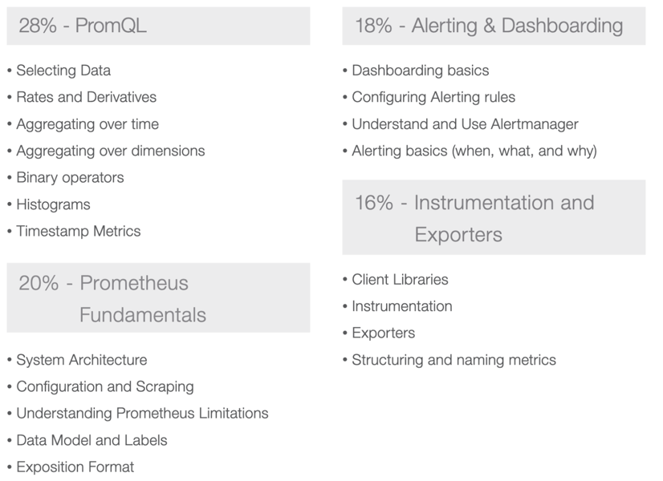
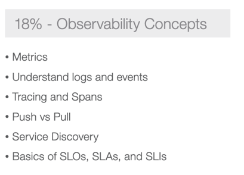

* goal
  * Prometheus' monitoring system & time series database
    * support &
    * training providers 

# certifications
* [Prometheus Certified Associate (PCA)](https://www.cncf.io/training/certification/pca/)
  * goal
    * observability -- via -- Prometheus 
      * |
        * cloud native
        * NOT cloud native
    * monitoring
  * [guide](https://github.com/cncf/curriculum/blob/master/PCA_Curriculum.pdf)
  * audience
    * SysAdmins,
    * Devs,
    * Ops,
    * SREs
    * Platform
  * recommended knowledge
    * KCNA, 
    * CKA,
    * CKAD
  * allows, based on observability,
    * improve application performance,
      * _Examples:_ `response_time_seconds`
    * troubleshoot system implementations,
      * _Examples:_ 
        * _Example1:_ configuration problems -- as -- `memory_usage`
        * _Example2:_ network problems -- as -- `network_errors_total`
        * ...
    * feed that data -- to -- other systems
      * _Example:_ Slack, email, Grafana, Kibana, ...
  * [enroll](https://training.linuxfoundation.org/certification/prometheus-certified-associate/?ajs_aid=d1fa7bfe-9981-47cf-ae51-ffd559949ed1)
  
  
  

# courses & trainings
* [Linux Foundation](https://training.linuxfoundation.org/training/monitoring-systems-and-services-with-prometheus-lfs241/)
  * OFFICIAL one
* [PromLabs](https://training.promlabs.com/)
* [Robust Perception](https://training.robustperception.io/)
* [acend](https://acend.ch/en/trainings/prometheus/)
* [KodeKloud](https://kodekloud.com/courses/prometheus-certified-associate-pca/)
